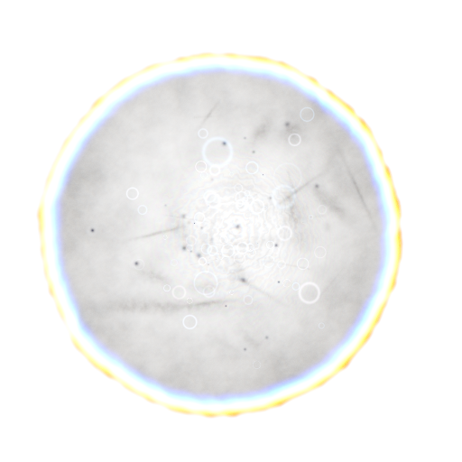
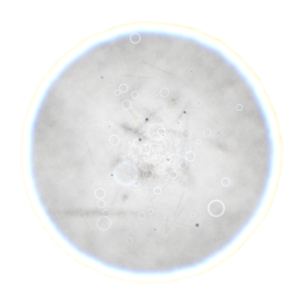
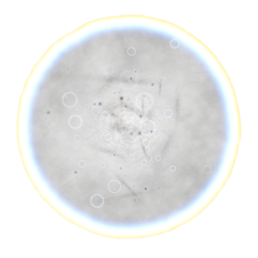
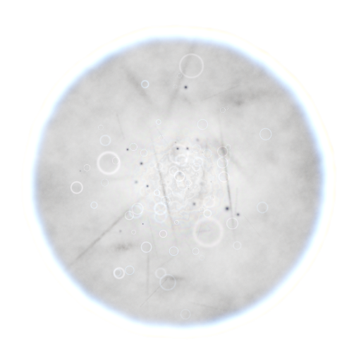
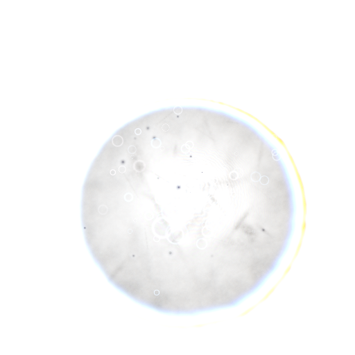
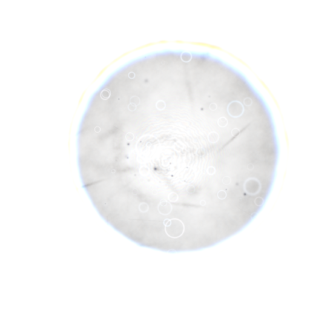
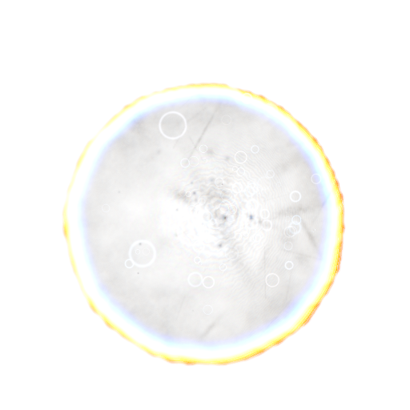
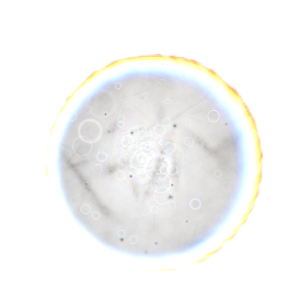
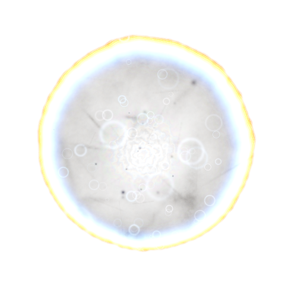
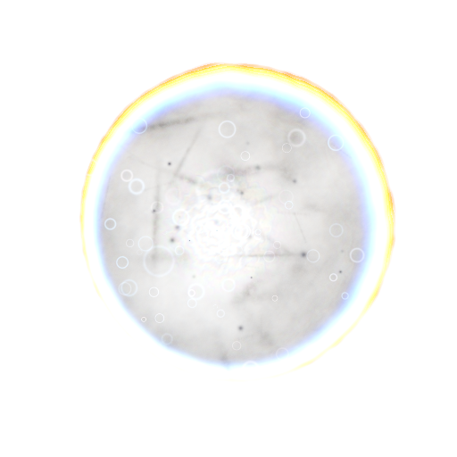

# Kernel Generator

Procedural C++ generator for physically inspired bokeh kernels.

The program builds a lens model from a seed, evaluates aperture shape, field position, defocus, chromatic shift, rim energy, dust, bubbles and scratches, then writes a TGA preview image. It also includes discrete sampling data for importance sampling the generated kernel.

## Features

- Deterministic lens generation from a numeric seed.
- Procedural aperture shape with blade count, rounded blades and cat-eye deformation.
- Field-dependent aberration controls for defocus, spherical aberration, coma, astigmatism and trefoil.
- Spectral weighting and chromatic offsets across the kernel.
- Dust, bubbles, streaks and subtle grain for lens character.
- Probability tables for direct kernel sampling.
- Optional kernel bank generation across field, defocus, aperture and focal ranges.

## Examples

Each row uses one fixed optical setup. The columns change only the seed.

| Setup | Seed A | Seed B | Seed C |
| --- | --- | --- | --- |
| Balanced off-axis<br>`field=(0.58, -0.22)`<br>`defocus=0.75 aperture=0.95 focal=0.85` |  |  |  |
| Centered soft focus<br>`field=(0.00, 0.00)`<br>`defocus=0.45 aperture=1.00 focal=1.20` |  |  |  |
| Edge cat-eye<br>`field=(1.00, 0.60)`<br>`defocus=1.05 aperture=0.72 focal=0.65` |  |  |  |
| Heavy reverse defocus<br>`field=(-0.85, 0.35)`<br>`defocus=-1.20 aperture=0.62 focal=0.55` |  |  |  |

## Requirements

- CMake 3.20 or newer.
- A C++17 compiler.

No external runtime libraries are required.

## Build

```powershell
cmake --preset release
cmake --build --preset release
```

Or configure CMake manually:

```powershell
cmake -S . -B build/release -DCMAKE_BUILD_TYPE=Release
cmake --build build/release --config Release
```

## Run

```powershell
.\build\release\bin\kernel_generator.exe 1337 512 512 bokeh_kernel_system.tga
```

Arguments:

```text
kernel_generator [seed] [width] [height] [output.tga] [fieldX] [fieldY] [defocus] [aperture] [focal]
```

Defaults:

- `seed`: `1337`
- `width`: `512`
- `height`: `512`
- `output.tga`: `bokeh_kernel_system.tga`
- `fieldX`: `0.58`
- `fieldY`: `-0.22`
- `defocus`: `0.75`
- `aperture`: `0.95`
- `focal`: `0.85`

## Repository Layout

```text
.
├── bokeh_kernel_system.cpp
├── CMakeLists.txt
├── CMakePresets.json
├── docs/
├── .gitattributes
├── .gitignore
└── README.md
```

## Notes

The current implementation is a standalone executable. The core structures and functions are kept in one translation unit so the kernel model can be moved into a library or renderer integration later without additional dependencies.
