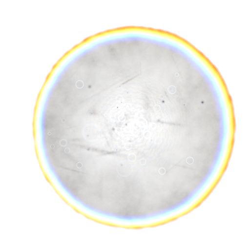
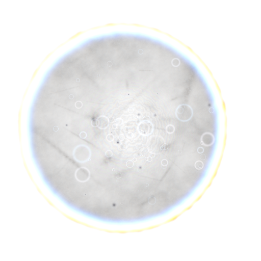
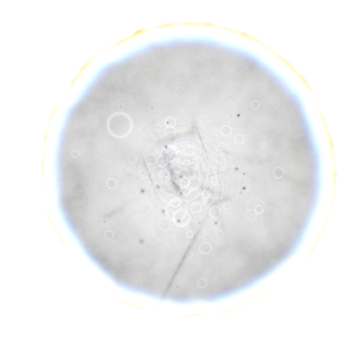

# Kernel Generator

Procedural C++ generator for physically inspired bokeh kernels.

The program builds a lens model from a seed, evaluates aperture shape, field position, defocus, chromatic shift, rim energy, dust, bubbles and scratches, then writes a TGA preview image. It also includes discrete sampling data for importance sampling the generated kernel.

## Features

- Deterministic lens generation from a numeric seed.
- Procedural aperture shape with blade count, rounded blades and cat-eye deformation.
- Field-dependent aberration controls for defocus, spherical aberration, coma, astigmatism and trefoil.
- Spectral weighting and chromatic offsets across the kernel.
- Dust, bubbles, streaks and subtle grain for lens character.
- Probability tables for direct kernel sampling.
- Optional kernel bank generation across field, defocus, aperture and focal ranges.

## Examples

Example kernels produced with the default field, defocus, aperture and focal settings.

| Seed 1337 | Seed 2401 |
| --- | --- |
|  |  |

| Seed 4099 | Seed 8191 |
| --- | --- |
|  |  |

## Requirements

- CMake 3.20 or newer.
- A C++17 compiler.

No external runtime libraries are required.

## Build

```powershell
cmake --preset release
cmake --build --preset release
```

Or configure CMake manually:

```powershell
cmake -S . -B build/release -DCMAKE_BUILD_TYPE=Release
cmake --build build/release --config Release
```

## Run

```powershell
.\build\release\bin\kernel_generator.exe 1337 512 512 bokeh_kernel_system.tga
```

Arguments:

```text
kernel_generator [seed] [width] [height] [output.tga]
```

Defaults:

- `seed`: `1337`
- `width`: `512`
- `height`: `512`
- `output.tga`: `bokeh_kernel_system.tga`

## Repository Layout

```text
.
├── bokeh_kernel_system.cpp
├── CMakeLists.txt
├── CMakePresets.json
├── docs/
├── .gitattributes
├── .gitignore
└── README.md
```

## Notes

The current implementation is a standalone executable. The core structures and functions are kept in one translation unit so the kernel model can be moved into a library or renderer integration later without additional dependencies.
